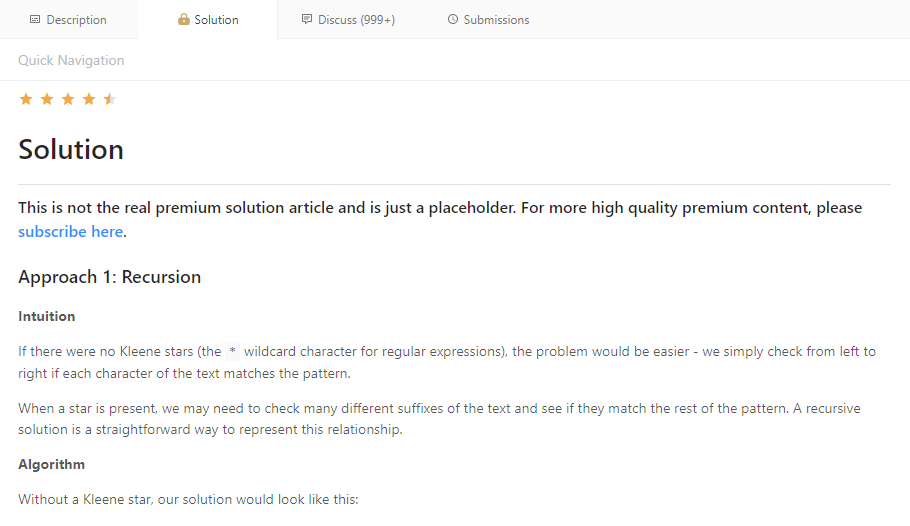

# Readable Solution LeetCode

  

## About

This script helper readable solution on Leetcode site without Subscribe to unlock

## Usage

#### Step 1: ScriptManager

-  [Greasemonkey](https://addons.mozilla.org/firefox/addon/greasemonkey/) or Scriptish (Not supported/Addon has been discontinued)
-  [Tampermonkey](https://chrome.google.com/webstore/detail/tampermonkey/dhdgffkkebhmkfjojejmpbldmpobfkfo) or Native (Not supported)
-  [Tampermonkey](https://addons.opera.com/extensions/details/tampermonkey-beta/) or [Violentmonkey](https://addons.opera.com/extensions/details/violent-monkey/)
-  [Tampermonkey](https://safari.tampermonkey.net/tampermonkey.safariextz) or [NinjaKit](https://github.com/os0x/NinjaKit)
-  [Tampermonkey](https://www.microsoft.com/store/p/tampermonkey/9nblggh5162s)

> ##### Note: After installation (which requires restarting your browser), you are now ready to install userscripts.

#### Step 2: UserScript

- [Install](https://greasyfork.org/en/scripts/443236-readable-solution-leetcode) _from greasyfork.org_
- [Install](https://openuserjs.org/scripts/DungGramer/Readable_Solution_LeetCode) _from openuserjs.org_
- [Install](https://raw.githubusercontent.com/DungGramer/Readable_Solution_LeetCode/main/readable-solution-leetcode.user.js) _from github.com_

## Supported Browsers

-  Firefox &#10004;
-  Chrome &#10004;
-  Opera &#10004;
-  Safari &#10004;
-  Microsoft Edge &#10004;
